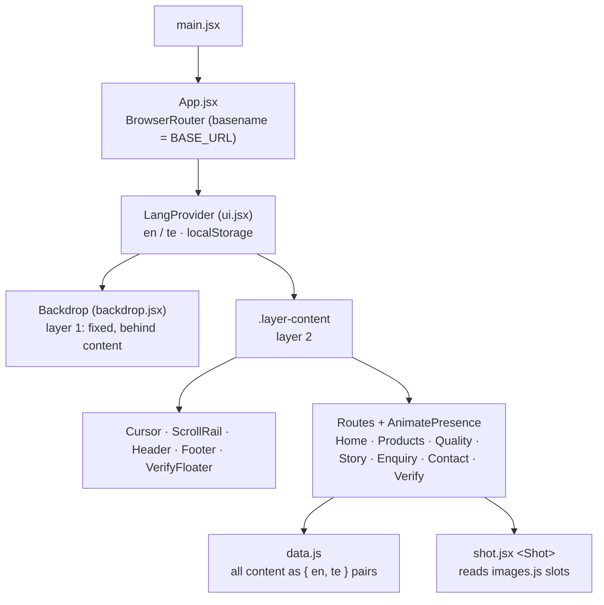

# Manasa Dairy: website

A bilingual (English / తెలుగు) institutional B2B website for Manasa Dairy, a Telangana dairy supplying since 1998.

**Live:** https://chanman22git.github.io/manasa-dairy/

## Executive summary

- **What it is:** the public website for Manasa Dairy (Uppariguda, Ibrahimpatnam, R.R. District). It lets hotels, caterers, canteens, bakeries and distributors evaluate the dairy and send a bulk enquiry.
- **Who it's for:** institutional buyers, in their own language. Every string on the site switches between English and Telugu, and the visitor's choice is remembered.
- **Status:** in development and deployed to GitHub Pages. Most photography is still placeholder imagery, the Telugu copy needs a native-speaker review, and the enquiry form does not send yet (see [Roadmap](#roadmap-and-known-limitations)).
- **How it's built:** React 19 + Vite, React Router with seven routes, and Motion for scroll- and pointer-driven animation. All motion is gated behind `prefers-reduced-motion`.
- **Design basis:** built from a design handoff bundle. Its palette, logo and copy are kept. The layout was rebuilt around motion, and contrast was corrected past the handoff to meet WCAG AA.

## Features

- **Seven routes:** Home `/`, Products `/products`, Quality `/quality`, Story `/story`, Bulk enquiry `/enquiry`, Contact `/contact`, and Verify a batch `/verify`. Each route sets its own document title. Unknown paths fall back to Home.
- **EN / తెలుగు toggle** for the whole site: headings, body copy, product specs, protocol steps, timeline, form labels, dropdown options, placeholders and footer. The choice is persisted to `localStorage` (`manasa-lang`).
- **Product catalogue** in three categories, each with specs: Milk (toned, full cream, standardised, double toned), Ghee (cow and buffalo), and Fresh dairy (paneer, set curd, white butter).
- **Bulk-enquiry form** with required-field validation (business, contact person, phone), accessible inline errors, focus on the first invalid field, and an animated confirmation panel.
- **Batch verification (stub):** a floating QR button in the bottom-right corner of every page opens an explainer card linking to `/verify`. It shows as a pill that shrinks to just the glyph after scrolling. The page accepts `/verify?batch=<code>` and echoes the scanned code, so QR codes can go to print before the lookup is built.
- **Hero:** three frames cross-dissolve (farmland, then a branded Manasa glass, then a child with the glass). Each frame holds for 3 s with a 0.9 s dissolve. With reduced motion, the farmland frame stays.
- **Motion system:** word-mask headline reveals, a scroll progress rail, a magnetic-hover custom cursor, photography parallax, animated counters, a drawn protocol rail, hover zoom on cards, a marquee, and route crossfades. With `prefers-reduced-motion`, animations jump to their end state and the cursor and marquee switch off.

## What follows the handoff exactly

- **Colour tokens:** `#0E3A20 / #16532F / #2F7D4B / #A8CDB2 / #F5F3ED / #FBFAF6` and the three border greys, sampled from the logo. See `:root` in `src/index.css`.
- **Typography:** Instrument Serif (display), Karla (UI and body), Noto Sans Telugu.
- **Logo:** `public/manasa-logo.jpeg`, with the "Taste the best / EST. 1998 · TELANGANA" two-line block.
- **Copy:** headings, paragraphs, product specs, protocol steps and timeline entries come from the handoff (`src/data.js`). The invented contact data is the exception (see [Content status](#content-status)).
- **Routing:** real routes, as the handoff specifies, rather than the prototype's client-side page switching.
- **Layout constants:** 1320px container, 56px gutters, 0 radius (except the language pill), and no shadows. Depth comes from hairlines and card fills.

## Deliberate deviations from the handoff

| Deviation | Why |
|---|---|
| Layout reimagined with heavy motion graphics | Requested: keep the palette, logo and content, but make the UI far more modern and animated. |
| Header is a floating pill, not the handoff's 82px full-width sticky bar | Requested, modelled on [cruip/tailwind-landing-page-template](https://github.com/cruip/tailwind-landing-page-template). See [Header](#header). |
| Seven of the handoff's photo placeholders replaced | The originals showed the wrong product, a competitor's branding, or a supermarket shelf. See [Photography](#photography). |
| `--muted` darkened from `#6F7F6C` to `#63715F` | The handoff value gives only 3.84:1 on paper at the 11–13px sizes where it is used. `#63715F` reaches 4.66:1 (WCAG AA) in the same hue family. |
| Several low-alpha whites raised (`.45→.62`, `.6/.62/.66→.75`) | Same reason: all were under 4.5:1 on the green bands. |
| Page surface is the `--backdrop` token (white), not `--paper` `#F5F3ED` | This is part of the two-layer page setup. Set `--backdrop: #f5f3ed` to return to the specified cream. |
| Telugu extended from nav, H1s, headings and CTAs to the whole site | Requested. See [Telugu](#telugu-needs-a-native-review). |
| Batch-verification floater and `/verify` route added | Not in the handoff. Reserves the QR landing URL before the lookup exists. |

## How it works



### Internationalisation

Every string in `src/data.js` is an `{ en, te }` pair. Render it with `useTx()` for inline values or `useT()` for keys in the `T` map, both from `ui.jsx`. Plain strings pass through untouched, so a missing `te` falls back to English instead of breaking.

The Telugu font is applied with a `.te` class that is scoped to Telugu text only. It is never applied to a whole region, or Latin phone numbers and licence codes would be restyled too.

Deliberately **not** translated:

- postal addresses (couriers and Maps need them literal)
- phone numbers, email, licence numbers, and standard names (FSSAI, ISO 22000:2018, AGMARK, NABL)
- units and measurement tokens (`%`, `ml`, `L`, `kg`, `MT`, `°C`, SNF, MBRT, HTST, CIP)
- Unsplash photographer credits and batch codes

### Two-layer pages

Every page is two stacked layers, set up once in `src/App.jsx`:

| Layer | Element | Role |
|---|---|---|
| 1: back | `.backdrop` (`src/backdrop.jsx`) | Fixed, full-viewport, `z-index: 0`, `pointer-events: none`. **Currently plain white; a background animation is meant to go here.** |
| 2: front | `.layer-content` | `position: relative; z-index: 1`. Header, main, footer and the verify floater all live here. |

To add a background animation, put it inside `<div className="backdrop-stage">` in `src/backdrop.jsx`. The stage is already full-bleed, behind the content and transparent to pointer events. Gate the animation on `useReducedMotion()`. The green bands, cards and footer are opaque, so the backdrop only shows through the neutral areas.

### Header

The top bar follows the "Simple Light" treatment from [cruip/tailwind-landing-page-template](https://github.com/cruip/tailwind-landing-page-template): a rounded, translucent, blurred bar detached from the top edge, with a hairline gradient border and a soft shadow.

**No code was copied from that repo, and Tailwind was not added.** The treatment is rebuilt on this project's own tokens in `.hdr` / `.hdr-shell` (`src/index.css`). That repo ships no LICENSE file, and its README's terms contradict each other, so reimplementing a generic floating-bar pattern avoided pulling unclear terms into a client codebase.

This departs from the handoff in a few ways:

- The header is `position: fixed`, so `main` carries a matching `padding-top`.
- The bar is 66px tall inside a 1180px shell.
- The logo renders at 44px.
- The nav collapses to a burger menu at 1080px.

## Content status

### Contact details (corrected)

The handoff prototype shipped with **invented contact data**: three offices, three phone numbers, and plants named after Medak and Siddipet districts. The client has confirmed the real details, and every reference to Medak, Siddipet, Toopran, Gajwel and Hyderabad has been removed. The authoritative values are single constants in `src/data.js` (`PHONE`, `PHONE_TEL`, `EMAIL` and the office address):

```
PLOT NO:76, SY NO:1109/E, UPPARIGUDA (V), IBRAHIMPATNAM (M), R.R DIST
+91 70329 96099          (tel: link dials +917032996099)
info@manasadairy.com
```

The address is kept in the client's own capitalisation and is not translated.

### Still needs real data

- **Plants:** `PLANTS` in `data.js` is intentionally an **empty array**, because the handoff's plants were tied to the removed districts. While it is empty, the Quality page hides that block and shows the certifications instead. Adding entries in the documented shape brings the block back. Nothing was invented to fill it.
- **Certifications** are still the handoff's, including FSSAI licence `10014042000123`. They need to be confirmed against the client's actual licences.
- **Timeline milestones** kept their years and narrative but lost their place names. The client should read them through for accuracy.
- **Figures:** the service area is "Telangana, Andhra Pradesh & Maharashtra", per the client. The "4,200 farmer households" and "1.8 lakh litres" figures are still the handoff's and are unconfirmed.

### Telugu: needs a native review

The Telugu was written during development and **has not been reviewed by a native speaker**. It should be checked before launch, especially the technical dairy vocabulary (SNF, MBRT, HTST, CIP, granular ghee, clot-on-boiling) and the marketing register.

### Photography

**Most images are still Unsplash placeholders.** The handoff's instruction stands: replace them with Manasa's own photography. The exceptions are the logo and the hero's second and third frames (`public/manasa-glass.jpg` and `public/manasa-child.jpg`), which are Manasa's own assets.

Slots live in `src/images.js`, keyed by the handoff's stable ids (`md-hero`, `md-p1`, …). To swap one, change its `src` to a local asset and delete its `credit` / `href`. The credit overlay then disappears on its own. Assets in `public/` must be referenced through `import.meta.env.BASE_URL`, because the site is served under `/manasa-dairy/`.

Seven handoff placeholders could not ship as they were and were replaced:

| Slot | Handoff placeholder showed | Replaced with |
|---|---|---|
| `md-plant` | a supermarket dairy aisle full of competitor packaging | stainless processing tanks |
| `md-p9` (White Butter) | a Kerrygold-branded butter pack | an unbranded pat of butter |
| `md-p5` / `md-p6` (Ghee) | a milk bottle with cookies; cookies and a jar of milk | ghee in jars |
| `md-p7` (Paneer) | a milk bottling line | a block of fresh white cheese |
| `md-p8` (Set Curd) | a jar of milk | plain set curd in a bowl |
| `md-map` | a close-up of cattle, under "Find us" | aerial farmland, captioned honestly as *not* a map |

Two known weaknesses remain, and both need real photography rather than another swap:

- **`md-story`** is a red North American barn, which is the wrong region for a Telangana village story.
- **`md-cat-fresh` / `md-p7`** show Adyghe cheese, which resembles paneer but is not paneer.

## Tech stack

- **React 19** and **React DOM**
- **React Router 7** (`BrowserRouter` with `basename` set from Vite's `BASE_URL`)
- **Motion 12** (`motion/react`): animation, scroll and pointer effects, `useReducedMotion`
- **Vite 8** with `@vitejs/plugin-react`
- **oxlint** for linting
- Plain CSS with design tokens (`src/index.css`). No CSS framework.
- **GitHub Pages** via GitHub Actions

## Project structure

```
manasa-dairy/
├── .github/workflows/deploy.yml   # Build + deploy to GitHub Pages on push to main
├── index.html                     # Vite entry HTML
├── vite.config.js                 # base '/manasa-dairy/' + 404.html SPA fallback plugin
├── package.json
├── public/
│   ├── manasa-logo.jpeg
│   ├── manasa-glass.jpg           # Hero frame 2 (own asset)
│   └── manasa-child.jpg           # Hero frame 3 (own asset)
└── src/
    ├── main.jsx                   # React root
    ├── App.jsx                    # Routes, page transitions, document titles, two-layer shell
    ├── ui.jsx                     # Header, footer, language context, motion primitives, cursor
    ├── backdrop.jsx               # Layer 1: fixed backdrop stage (plain for now)
    ├── verify.jsx                 # Floating batch-verification button + card
    ├── art.jsx                    # Brand mark and utility glyphs (SVG)
    ├── shot.jsx                   # <Shot>: a photography slot (lazy, no layout shift, parallax, credit)
    ├── images.js                  # Every photo slot: src, alt, credit. Swap real photos here
    ├── data.js                    # All content + i18n strings ({ en, te } pairs)
    ├── index.css                  # Design tokens and layout
    └── pages/                     # Home · Products · Quality · Story · Enquiry · Contact · Verify
```

## Running locally

Requires **Node.js ^20.19 or ≥ 22.12** (Vite 8's engine range). CI uses Node 20.

```bash
git clone https://github.com/Chanman22git/manasa-dairy.git
cd manasa-dairy
npm ci
npm run dev        # http://localhost:5173/manasa-dairy/
```

Other scripts:

```bash
npm run build      # production build to dist/ (also writes dist/404.html)
npm run preview    # serve the production build locally
npm run lint       # oxlint
```

The dev server serves the app under `/manasa-dairy/`, because `base` is set in `vite.config.js`.

## Deployment

The site deploys to GitHub Pages through **GitHub Actions** (`.github/workflows/deploy.yml`). The repo's Pages source is set to "GitHub Actions".

- **Trigger:** every push to `main`, or a manual `workflow_dispatch`.
- **Build job:** Node 20, then `npm ci`, then `npm run build`. The `dist/` folder is uploaded as the Pages artifact.
- **Deploy job:** `actions/deploy-pages@v4` publishes to the `github-pages` environment. Concurrency is grouped, so a running deploy finishes before the next one starts.

Two settings in `vite.config.js` make client-side routing work on Pages:

- `base: '/manasa-dairy/'` matches the repo path, and React Router receives the same value as its `basename`.
- A small plugin copies `dist/index.html` to `dist/404.html`. Pages has no SPA rewrite and serves `404.html` for unknown paths, so deep links such as `/manasa-dairy/products` work on a hard refresh.

To host the site elsewhere, change `BASE` in `vite.config.js`. On a host with real rewrites (Netlify, Vercel or nginx), route unknown paths to `index.html`.

## Roadmap and known limitations

- **Connect the enquiry form to a backend or email service.** `src/pages/Enquiry.jsx` currently validates the form and shows the confirmation panel, but the submission is not sent anywhere. Keep the inline success state when it is wired up.
- **Replace placeholder photography** with Manasa's own photos (see [Photography](#photography)).
- **Native-speaker review of the Telugu copy** before launch.
- **Confirm the handoff figures and certifications** (FSSAI licence, 4,200 households, 1.8 lakh litres, timeline) and add real `PLANTS` data.
- **Build the batch-verification lookup** behind `/verify?batch=<code>`. The page is a stub today.
- **Add an interactive map** on the Contact page. The aerial photo is a labelled placeholder.
- **Background animation** in the backdrop layer (the slot is ready in `src/backdrop.jsx`).
- **Move content to a CMS.** Everything in `src/data.js` is static.

## Author

Built by **Chandru** ("BuiltByInstincts"), Product & Data Builder, Bengaluru. I build products at the intersection of AI, data, and human behaviour.

- Portfolio: https://chanman22git.github.io/builtbyinstincts/
- LinkedIn: https://linkedin.com/in/chandrasekarv22
